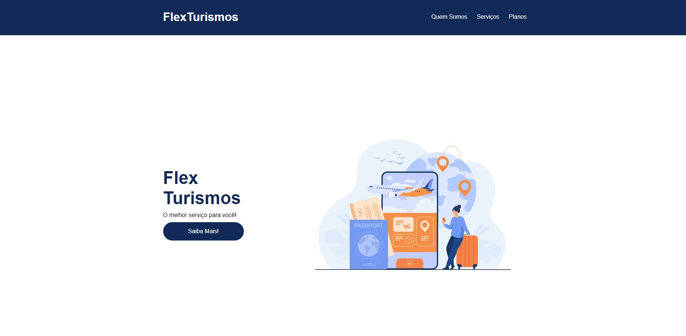
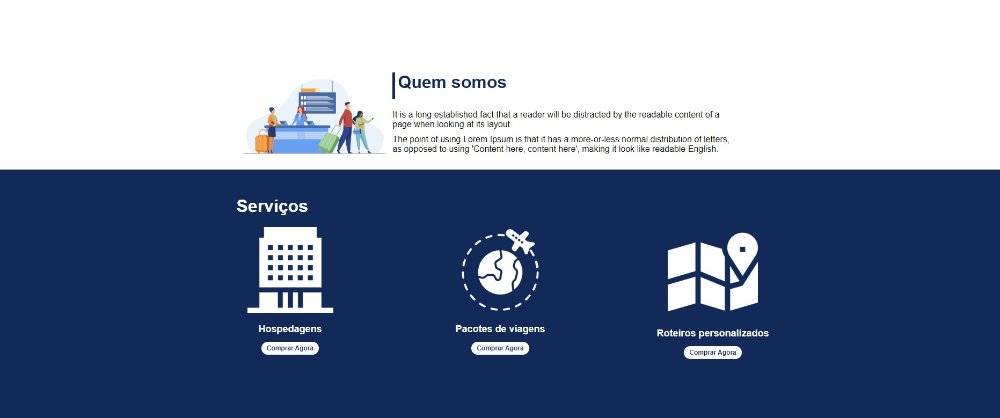
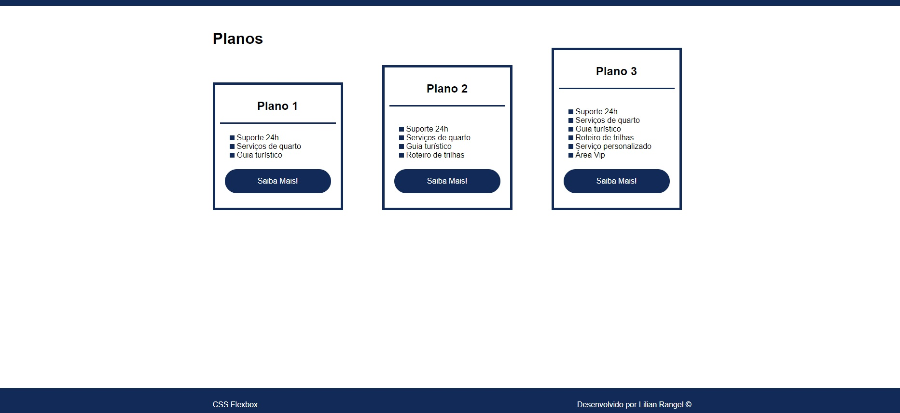

<h1 align="center"> Projeto Flex Turismo </h1>

<h2 align="center">Aprendizados nesse projeto 🎯</h2>
Um dos meus primeiros projetos onde fui apresentada aos fundamentos do CSS Flexbox para alinhamento e posicionamento, e a como utilizar suas funcionalidades corretamente. 

<h2 align="center">Tecnologias utilizadas 🛠</h2>  

<h2 align="center">Deploy 👨🏽‍💻</h2>
<a href="https://lilian-rangel.github.io/Projeto-Flex-Turismo/" target="_blank">Confira a página nesse link</a>

<h2 align="center">Prints da página</h2>

